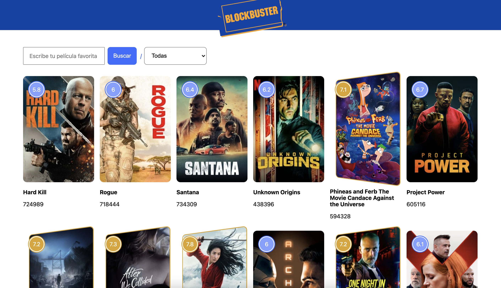

# Block-master

Proyecto del curso JavaScript Avanzado https://leonidasesteban.com/aprender
En este curso realizamos el proyecto de Block Master aprendiendo : Template Literals, expresiones , style component, metodos de los arrays , POO y muchas cosas mas...

